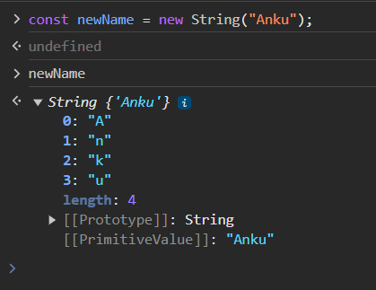

# JavaScript Important Notes

- We can print the values with the help of `console.table`
- It will give me the result in the form of Table

```JavaScript
console.table([firstName, lastName, isGoogleLoggined, currentCity])
```

---

### DataTypes in JavaScript

1. number
2. string
3. boolean
4. bigint => eg : `let number = 1212122334234324354465465464564n`
   > // N at the End
5. null => **typeof is Object**
6. undefined
7. symbol => **Symbol is Unique**

```JavaScript
let value = Symbol("123");
const value2 = Symbol("123");

console.log(value);
console.log(value2);
console.log(value === value2); /* False */

/* Symbol is unique, IT IS used for uniquess */
```

### Conversation & Comparsions

- Conversation

  - While conversation be sure about the value that you are going to convert
  - `Empty string into Number` will be 0
  - `Null into Number` will also be 0

- Comparsions
  - When you are Comparion null with Zero

```JavaScript
let value = "";
let valueInNumber = Number(value); /* When converting into the number */
/*
    "33" - 33
    "33abc" - nan
     "" - 0
     undefined - nan
     null - 0
*/
console.log(null > 0); /* False */
console.log(null == 0); /* false */
console.log(null >= 0); /* True, as when we are checking the value, null is considered as 0  */
// Interview Question - Null means completely empty
```

---

### Heap and Stack in JavaScript

- In Javascript we have classified Javascript in two Types
  - Primitive - `string, number, bigint, boolean, undefined, null, symbol`
  - Non Primitive - `Array, Objects, Functions`
- There are 2 types of memories that are used in Javascript

  - Stack - for **Primitive Datatypes**
    - In stack memory we will get the **copy of variable**
    - Apko uski copy milte hai
  - Heap - for **Non-Primitive Datatypes**

    - In Heap memory we get the **Reference**
    - So, jo bhi change hoga, vo Original value me hoga

    

```Javascript
// Primitive Types - Stack
// Non-Primitive Types - Heap

let myName = "Ankush";

let anotherName = myName;

anotherName = "Ankush Thakur";

console.log(myName)
console.log(anotherName)
/* Here it is not a Reference we are creating a new copy it */


let userOne = {
    name: "JavaScript",
    email: "abc@gmail.com"
}

let userTwo =  userOne; /* Here we are getting the reference, therefore it will change */

// Now, if we dont want to change the reference then we need to create a copy of userOne, this could be done my spread operator

// let userTwo = {...userOne}

userTwo.email = "ankush@gmail.com";

console.log(userOne);
console.log(userTwo);

```

### String

- We can Declare the String using `new` Keyword
- `const myVar = new String("Hello World");`
- MyVar will be an Object which will have key value pair
  

### Methods in String

```javascript
const myVar = new String("Hello World");
const gameName = new String("hitesh-hc-com");
const paragraph = "I think Ruth's dog is cuter than your dog! is";
const regex = /[A-Z]/g; /* Capital A to Z, /g - stands for global flags,  When this flag is used, searches for all matches within the entire string. Without this flag, it would only find the first match and then stop. */
const filePath = String.raw`C:\Development\profile\aboutme.html`;
const newData = "C:Developmentprofileaboutme.html";
```

| Methods            | Explanation                                                                                                                  | Code                                                                                                                | Output                                                                                                                          |
| ------------------ | ---------------------------------------------------------------------------------------------------------------------------- | ------------------------------------------------------------------------------------------------------------------- | ------------------------------------------------------------------------------------------------------------------------------- |
| **length**         | Provide length of the given String                                                                                           | `console.log(gameName.length)`                                                                                      | 13                                                                                                                              |
| **charAt(2)**      | Return character at index 2                                                                                                  | `console.log(gameName.charAt(2))`                                                                                   | t                                                                                                                               |
| **indexOf(t)**     | Return index of character 't'                                                                                                | `console.log(gameName.indexOf("t"))`                                                                                | 2                                                                                                                               |
| **at(0)**          | Takes integer value and returns the item at that index, allowing for **positive and negative** integers'                     | `console.log(newName.at(-1));     console.log(newName.at(0));`                                                      | A, r                                                                                                                            |
| **substring(4,8)** | Get substring from index 4 to index 7 as EndIndex is excluded                                                                | `console.log(gameName.substring(4, 8));`                                                                            | sh-h                                                                                                                            |
| **slice(-4,8)**    | Same as SubString, but also accepts the **Ne** Value, -8 from last and 1 from Starting                                       | `console.log(gameName.slice(-8, 1);`                                                                                | hitesh                                                                                                                          |
| **trim()**         | Remove leading and trailing spaces                                                                                           | `console.log("    Ankush Thakur    ".trim());`                                                                      | Ankush Thakur                                                                                                                   |
| **replace**        | find the word in the string and replaces it, in Multiple occurence as well                                                   | `console.log("https://hitesh.com/hitesh%20choudhary.replace("%20", "-"))`                                           | https://hitesh.com/hitesh-choudhary                                                                                             |
| **includes**       | return TRUE if found the element in the String, Otherwise False, CASE SENSITIVE                                              | `console.log("Hello Ankush, How are you".includes("are"));`                                                         | true                                                                                                                            |
| **split**          | splits a string into an array of substrings                                                                                  | `console.log(gameName.split("-"));`                                                                                 | [ 'hitesh', 'hc', 'com' ]                                                                                                       |
| **lastIndexOf()**  | searches this string and returns the index of the last occurrence, if not found then -1, IT is Case Sensitive                | `console.log(paragraph.lastIndexOf("Ankush"));    console.log(paragraph.lastIndexOf("dog"));`                       | -1, 38                                                                                                                          |
| **match()**        | Matches the String, with the regular Experssion Regex, returns an array with the matches, returns null if no match is found. | `console.log(paragraph.match(regex))`                                                                               | ["T", "R"]                                                                                                                      |
| **String.raw()**   | is a static method that is used to get the raw string form of template literals                                              | `console.log(`The file was uploaded from: ${filePath}`);  console.log(`The file was uploaded from: ${newData}`);  ` | "The file was uploaded from: C:\Development\profile\aboutme.html", The file was uploaded from: C:Developmentprofileaboutme.html |


---

### Numbers

- You can Declare number with help of `new` Keyboard
- `const balance = new Number(100)`
-  We have round, floor, ceil, min, max which are self-explainatory


```javascript
const balance = new Number(100)
const otherNumber = 123.8966
const hundreds = 1000000
```

Methods in Numbers

| Methods              | Explanation                                      | Code                                                                                         | Output                |
| -------------------- | ------------------------------------------------ | -------------------------------------------------------------------------------------------- | --------------------- |
| **toFixed()**        | Value upto how many Decimal places               | `console.log(balance.toFixed(2));`                                                           | 100.00                |
| **toPrecision()**    | Decimal se PHLE KITNI DIGIT, so be very carefull | `console.log(gameName.otherNumber.toPrecision(1))   console.log(otherNumber.toPrecision(3))` | 1e+2,   124           |
| **toLocaleString()** | Return number as per Different formats           | `console.log(hundreds.toLocaleString()), console.log(hundreds.toLocaleString('en-IN'))`      | 1,000,0000, 10,00,000 |
| **abs()**            | always return a positive Integer                 | `console.log(Math.abs(-4));`                                                                 | 4                     |


```javascript

console.log(Math.random()); /* 0-1 */
console.log((Math.random()*10) + 1); /* +1 , so that 0 should not be the output */
console.log(Math.floor(Math.random()*10) + 1);

const min = 10
const max = 20

console.log(Math.floor(Math.random() * (max - min + 1)) + min)


console.log("jjjjj",Math.abs(100, 20))
```